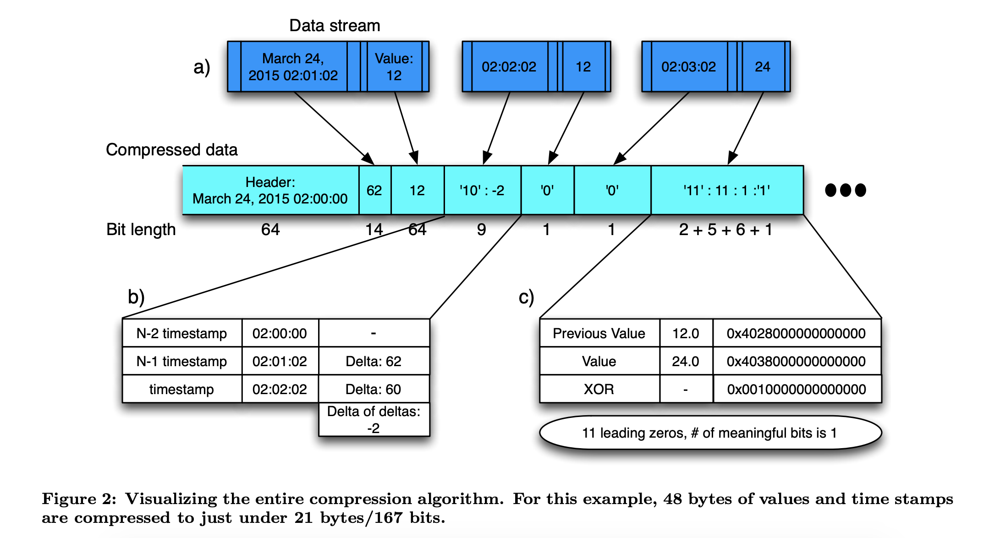
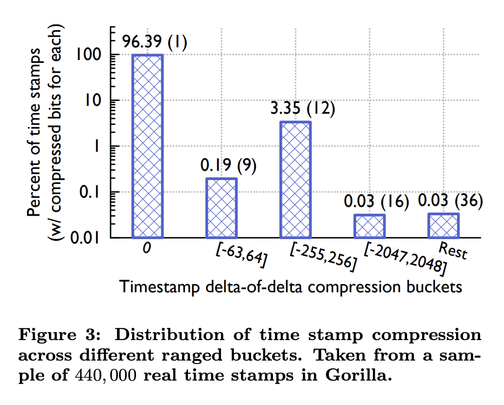
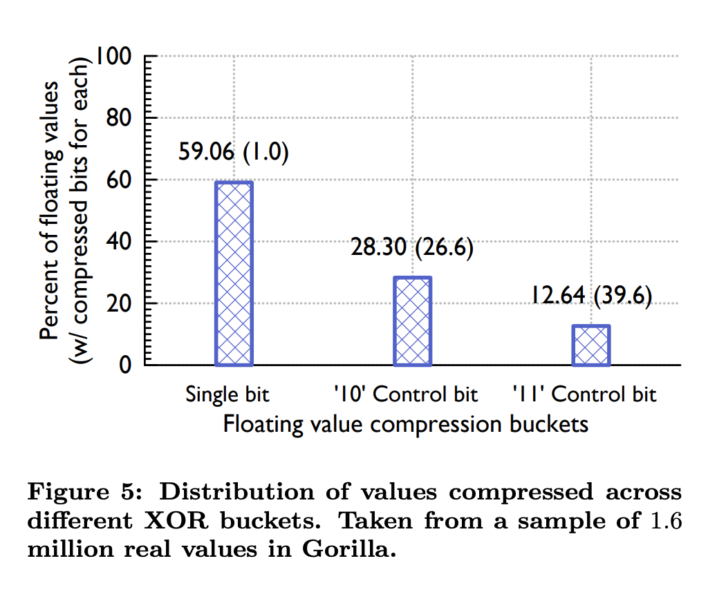
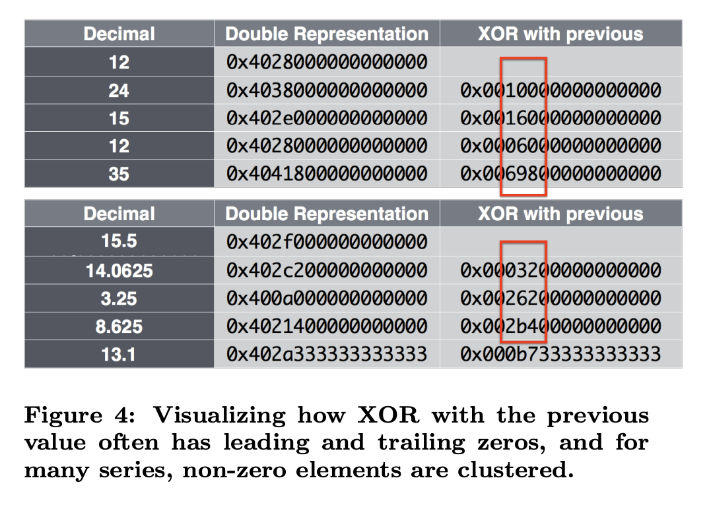
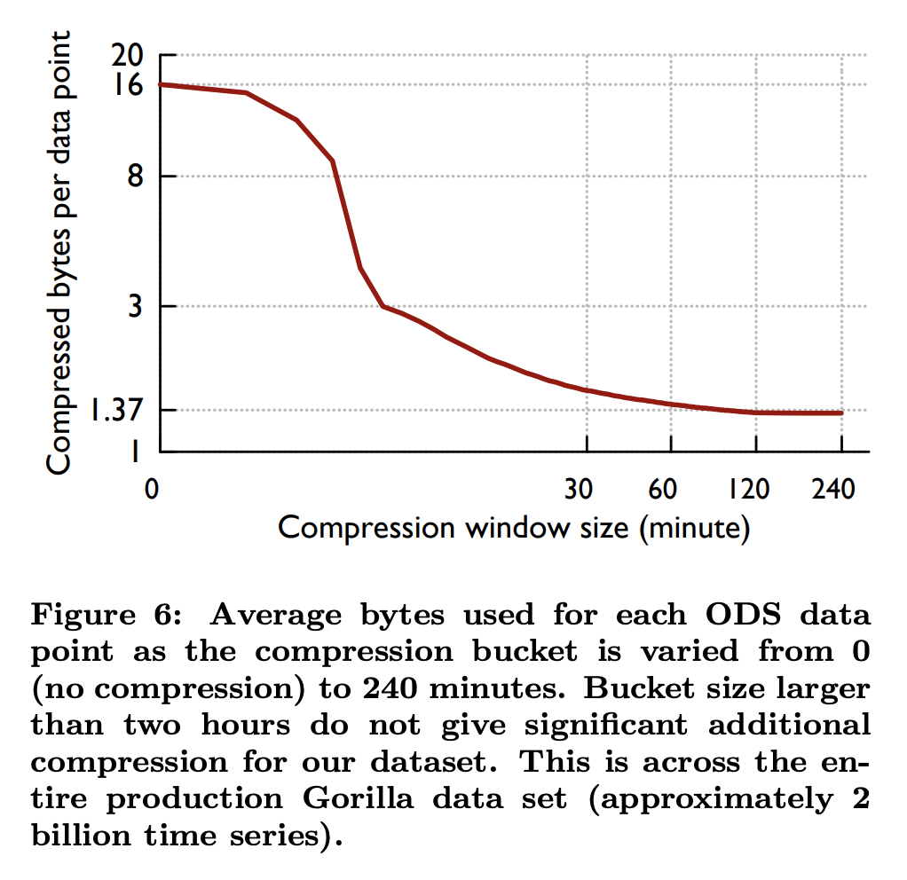
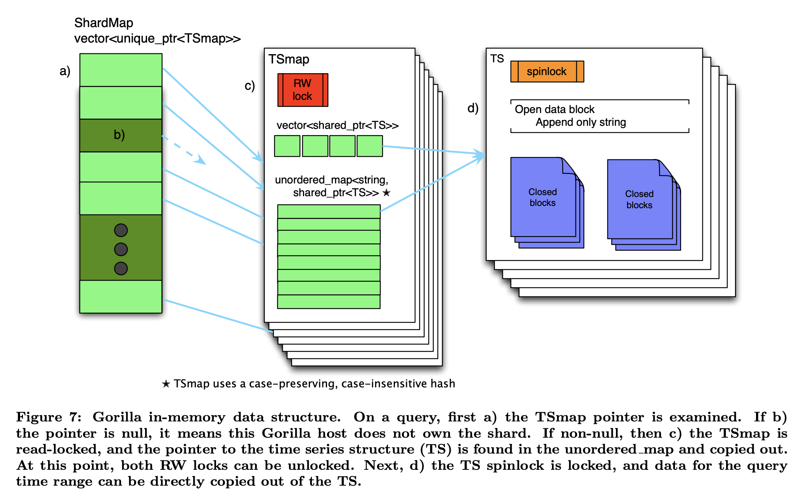

# Gorrila: A Fast, Scalable, In-Memory Time Series Database

## 阅读指南

论文的核心点在 **Section 4**，主要讲的是 Gorilla 的整体架构设计。

在大规模互联网服务架构中，监控和分析服务需要大量的测量数据（指标数据），特别有效的解决方案是在 TSDB（Time Series Database 时序数据库）中存储和查询这些数据。过去，Facebook 是基于 HBase 研发的 TSDB，ODS（Operational Data Store），基于磁盘的查询写入性能以及数据结构设计的存储空间上不是很高效。为此，Facebook 设计了 Gorilla，In-Memory TSDB（内存时序数据库）。

## 问题分析

首先，Facebook 对于监控系统的用户关注点以及 ODS 遇到的问题进行分析，得出以下几点见解：

* 用户更加关注聚合分析而不是单个数据点
* 最近数据点比旧的数据点更有价值，可以快速检测和诊断持续问题的根因（至少 85% 的查询是基于过去 26h 内的数据）
* 确保大部分查询能够在 10ms 内完成
* 不存储用户数据，不需要保证 ACID
* 为了优化查询和减少存储空间，利用了压缩技术：_delta-of-delta timestamps_ 和 _XOR'd floating point value_
* Writes dominate（写远大于读）支持每秒存储数千万的数据点
* State transitions（状态变化）支持短时间窗口的细粒度聚合，来体现状态变化
* High Availability（高可用）支持在网络异常时写入本地 TSDB，需要时恢复数据
* Fault tolerance（容错）支持写复制到多个区域

为此，提出了设计 Gorilla 的一些要求：

* 支持由字符串 key 标识的 20 亿个唯一的 TS（time series 时序数据）
* 支持每分钟写入  70 亿的数据点（timestamp and value）
* 支持 26h 的数据存储
* 支持高峰期间每秒 4 万以上的查询
* 支持毫秒级别的读取
* 支持 15s 粒度的 TS
* 两个不同地区的内存副本（用于灾难恢复）
* 即使单个服务器崩溃，也始终提供读取服务
* 能够快速扫描所有的内存数据
* 支持每年至少 2x 的增长

## Gorilla 架构（核心）

Gorilla 是 In-Memory TSDB，用于写入 HBase 存储的监控数据的直写缓存。

Gorilla 中的监控数据由 3 元组组成：字符串 key、64-bit 时间戳和 64-bit 双精度浮点值。数据模型上采用了 TS 压缩算法来压缩每个 TS，存储大小从 16 bytes 减少到平均 1.37 bytes，减少了 12x。数据结构上的设计可以支持快速扫描所有数据，同时保证在常量时间内查找到单个 TS。

Gorilla 使用字符串 key 来标识唯一的 TS。根据 key 可以对所有数据进行分片，最终映射到单个主机上。因此，可以通过添加主机并调整分片结构，使新的时序数据映射到新的主机上，以便扩展 Gorilla。

Gorilla 通过将每个 TS 值写入不同地理区域的两台主机来容忍单节点故障、网络中断和整个数据中心故障。 在检测到故障时，所有读取查询都会故障转移到备用区域，确保用户不会遇到任何中断。

### Time series compression

Gorilla 压缩 TS 内的数据点，每个数据点是由一对 64 bits 的值和 64 bits 的时间戳组成的。**Feature 2** 显示了整个压缩方案。

Feature 2.a 说明了时序数据由成对的值和时间戳组成流。Gorilla 将数据流压缩成块，并按时间分区。在块头（block header）中进行时间戳对齐（2:00 am），并且使用压缩程度较低的格式存储第一个值之后。Feature 2.b 展示了时间戳通过 delta-of-delta 压缩算法进行压缩。Feature 2.c 展示了浮点值通过 XOR 压缩算法进行压缩。

#### Compressing time stamps

论文分析了 ODS 上的时序数据，发现大部分的数据点以固定时间间隔到达，比如每 60s 记录一个数据点，有时候可能早或晚 1s。

相比存储整个时间戳，更好的方法是存储时间戳增量的增量。如果 TS 中后续数据点之间的 delta 分别是 60，60，59 和 61，则 delta of deltas 的结果为 0，-1 和 2。

以下算法使用可变长度的编码对 delta of deltas 进行编码：

1. 块头（block header）存储起始时间戳$$t_{-1}$$ _，_该值对齐了 2h 的时间窗口；第一个时间戳$$t_{0}$$ ，作为 $$t_{-1}$$的 delta，以 14 bits（ $$2^{14} = 16384$$ ）存储在块中。其中 4h（16384s）作为 delta 已经足够了，Gorilla 支持提高这个值来达到更大的块。
2. 对于接下来的时间戳$$t_{n}$$：
   1. 计算 delta of delta：$$D = (t_{n} - t_{n-1}) - (t_{n-1} - t_{n-2})$$ 
   2. 如果 $$D$$ 为 0，则存储一个 '0'
   3. 如果 $$D$$ 在 $$[-63, 64]$$ 之间，则存储 '10'，随后存储 $$D$$ （7 bits， $$2^{7} = 128$$）
   4. 如果 $$D$$ 在 $$[-255, 256]$$ 之间，则存储 '110'，随后存储 $$D$$ （9 bits， $$2^{9} = 512$$）
   5. 如果 $$D$$ 在 $$[-2047, 2048]$$ 之间，则存储 ‘1110'，随后存储 $$D$$ （12 bits， $$2^{12} = 4096$$ ）
   6. 除此之外，则存储 '1111'，随后存储 $$D$$ （32 bits）

**Feature 3** 展示了 Gorilla 针对时间戳的压缩结果。结果显示 96% 的时间戳可以压缩在一个单个 bit。

#### Compressing values

Gorilla 将数据点的值限制为双精度浮点类型。通过分析 ODS 的数据，发现大多数 TS 数据点的值与其相邻的相比不会发生重大变化，而且只存储整型。经过对比当前值和先前值，如果值相近，则符号、指数和尾数的前几位将相同，因此对当前值和先前值做一个简单的 XOR 计算，来实现压缩方案。

以下算法使用可变长度的编码对 XOR 值进行编码：

1. 第一个值不进行压缩存储
2. 如果对前值进行 XOR 之后为 0（同样的值），则存储一个 '0'
3. 如果 XOR 之后是非 0，则计算 XOR 结果值的头部和尾部的 0 值的长度，存储 '1'，随后执行 3.1 或 3.2：
   1. 存储 '0'。如果当前有意义的位块（即除去头尾的 0 值），位于前一个有意义的位块内，也就是头尾 0 值的长度都跟前 XOR 值的一样，则使用该信息作为块位置，随后仅存储有意义的 XOR 值
   2. 存储 '1'。前 5-bits 存储头部 0 值的长度，然后接下来 6-bits 存储有意义的 XOR 值的长度，随后存储有意义的 XOR 值

**Feature 5** 描述了 XOR 编码如何有效地将值存储在 TS 中：

头尾的 0 值长度是该压缩算法的一个压缩因子。对于整数值的压缩效果会特别好，因为 XOR 值后有意义的位块通常在整个 TS 中是相同的，意味着大多数值有相同数量的尾部 0 值。如 Feature 4 所示：

编码方案（schema）中存在的一种权衡是压缩算法运行的时间跨度（time span）。在更长的时间段内使用相同的压缩方案会有有更好的压缩率。但是，希望在短时间内读取数据的查询可能需要在解码上花费额外的计算资源（笔者认为是需要读取块头导致）。Feature 6 展示了压缩率和时间窗口的关系，从 0（无压缩，64 bytes，64 bits 值 + 64 bits 时间戳）到 240m 的时间窗口，超过 2h 的时间窗口最多就只能压缩到 1.37 bytes。

### In-memory data structures

**Feature 7** 展示了 Gorilla 整个数据结构的概览：

**TSmap**，Timeseries Map，Gorilla 中主要的数据结构。TSmap 的组成包括：一个指向 TS 的 C++ 标准库共享指针（shared-pointers）vector、一个从 TS 名称到共享指针的不区分大小写和保留大小写的映射。vector 允许对所有数据进行高效的分页扫描，而 map 则支持特定 TS 的常量时间查找。

C++ 共享指针的使用使扫描能够在几微秒内复制 vector（或分页）。在删除一个 TS 时，一个 vector 条目标记为 tombstoned（墓碑），并且索引（index）被放置在一个空闲池中，当创建新的 TS 时会重新使用空闲池中的索引。tombstoning（墓碑化）的一段内存会被标记为 'dead'，并且准备好重新使用，而实际上不会释放给底层系统。

并发性是通过锁来实现的：TSmap 中用来保护 map 和 vector 访问的单个读写自旋锁、每个 TS 中的 1-byte 自旋锁。由于每个单独的 TS 的写入吞吐量相对较低，因此自旋锁在读取和写入之间的竞争非常低。

**ShardMap**，是 shardId（分片标识符）到 TSmap 的映射，由 TSmaps 指针组成的 vector 来维护的。将 TS 的名称映射到不同分片采用的方式和 TSmap 中的一样，使用不区分大小写的哈希完成的，将其映射到 \[0, NumberOfShards) 之间的 ID。由于系统中的分片总数是固定的，并且数量很少，因此在 ShardMap 中存储空指针的额外开销可以忽略不计。类似 TSmaps，ShardMap 持有一个读写自旋锁来控制并发访问。

由于数据已经被分片分区，使得单个 map 足够小（大约 100 万个条目），C++ 标准库 unordered-map 具有足够的性能，并且没有出现锁争用的问题。

**TS**，该数据结构由多个保存超过两小时的封闭数据块（closed blocks for data）和一个保存最新数据的开放数据块（open data block）组成。开放数据块只追加字符串（append-only string），用于追加新的被压缩的时间戳和值。每个块保存两个小时的压缩数据，开放数据块一旦填满就会关闭。一旦一个块被关闭，它就永远不会改变，直到它从内存中被删除。关闭时，一个块被复制到从大块（slag）分配的内存中以减少碎片。虽然开放数据块经常随着大小的变化而重新分配，但我们发现复制过程会减少了 Gorilla 中的整体碎片。

数据读取将可能包含查询时间范围内的数据块直接复制到输出远程过程调用结构中。 整个数据块返回给客户端，解压步骤在 Gorilla 之外完成。

### On disk structures

论文对 Gorilla 的目标之一是能够在单个主机故障中存活下来。

一个 Gorilla 主机将拥有多个数据分片，并且每个分片维护一个目录。每个目录包含四种类型的文件：key 列表（Key lists）、只追加日志（append-only logs）、完整的块文件（complete block files）和检查点文件（checkpoint files）。

key lists，是 TS 字符串 key 到 32-bit 整型标识符的映射。整型标识符是内存 vector 的索引。新的 key 会追加到当前 key lists 中，Gorilla 会定期扫描每个分片的所有 keys，以便重新写入文件。

当数据点流式传输到 Gorilla 时，它们会将时间戳和值压缩后存储在日志文件中。每个分片只有一个 append-only 日志，因此分片中的值在 TS 中交错。这种与内存中编码的区别，意味着每个成对的时间戳和值标有它的 32-bit 整数 ID，这样为每个分片的日志文件增加了显着的存储开销。

Gorilla 不提供 ACID 保证，因此，日志文件不是 write-ahead log（预写日志）。数据在被 flush 之前，最多缓存到 64kB，通常是包含一到两秒的完整数据。虽然缓存会在完全关闭时 flush，但崩溃有可能会导致丢失少量的数据。这种折衷是值得的，因为和传统的预写日志相比，它允许更高的写入率将数据写到磁盘中，并提供更高的可用性。

每两个小时，Gorilla 就会将压缩的块数据复制到磁盘，这种格式比日志文件小得多。每两小时的数据就有一个完整的块文件，包含两个部分：一组包含数据块的连续 64kB 的大块，直接是从内存中拷贝；一个  对的列表。一旦块文件完成，Gorilla 会生成 checkpoint 文件并删除相应的日志。checkpoint 文件用于标记完整的块文件何时刷新到磁盘。如果块文件在进程崩溃时没有成功刷新到磁盘，当新进程启动时，对应的 checkpoint 文件将不存在，因此新进程知道它不能信任块文件，只会从日志文件中读取数据。

### Handling failures（通读）

对于容错，我们选择优先容忍单个节点、可观察的零停机时间和大规模的临时故障以及局部故障（例如网络切断到整个区域）。这样做是因为单节点故障经常发生，并且大规模的局部故障成为 Facebook 规模的一个关注点，需要的是自然（或人为）灾难下依旧可以运行的能力。还有一个额外的好处是，可以将滚动软件升级建模为一组可控的单节点故障，因此针对这种情况的优化意味着可以轻松且频繁地进行代码推送。对于所有其他故障，我们选择了权衡，当它们确实导致数据丢失时，将优先考虑较新数据的可用性而不是旧数据。这是因为我们可以依靠现有的 HBase TSDB 系统来处理历史数据查询，并且只要有最新数据，检测时序数据的级别变化的自动化系统对于部分数据仍然有用。

Gorilla 通过在不同的数据中心区域维护两个完全独立的实例，确保它在数据中心故障或网络分区时保持高度可用。写入时，数据将流式传输到每个 Gorilla 实例，不保证一致性。 这使得大规模故障易于处理。当整个区域发生故障时，查询将定向到另一个区域，直到第一个区域已备份 26 小时。 这对于处理大规模灾难事件非常重要，无论是实际的还是模拟的。例如，当区域 A 中的 Gorilla 实例完全失败时，对该区域的读取和写入也会失败。读取失败会透明地重试给健康区域 B 的 Gorilla 实例。如果事件持续时间足够长（超过一分钟），则数据将从区域 A 中丢弃，并且不会重试请求。发生这种情况时，可以关闭区域 A 的所有读取，直到集群运行状况良好至少 26 小时。 此修复可以手动或自动执行。

**ShardManager**，基于 Paxos 的系统，在每个区域内将分片分配给节点。 当一个节点出现故障时，ShardManager 在集群中的其他节点之间分配它的分片。在分片移动期间，写入客户端会缓冲其传入数据。 缓冲区的大小可以容纳 1 分钟的数据，超过一分钟的数据点将被丢弃，以便为较新的数据腾出空间。我们发现这个时间段足以在大多数情况下允许重新分配分片，但对于长时间的中断，它会优先考虑最近的数据，因为从直觉上讲，最近的数据对于驱动自动检测系统更有用。当区域 A 中的 Gorilla 主机 α 因任何原因崩溃或宕机时，写入会缓冲至少 1 分钟，因为 Gorilla 集群会尝试恢复该主机。 如果集群的其余部分健康，分片移动会在 30 秒或更短的时间内发生，不会导致数据丢失。 如果移动速度不够快，则可以通过手动或自动过程将读取指向区域 B 中的 Gorilla 实例。

当分片添加到主机时，它将从 GlusterFS 读取所有数据。 这些分片可能在重新启动之前或其他主机之前已由同一主机拥有。主机可以在大约 5 分钟内从 GlusterFS 读取和处理它需要完全运行的所有数据。 由于系统中的分片数量和存储的总数据量，每个分片代表大约 16GB 的磁盘存储空间。这可以在几分钟内从 GlusterFS 读取，因为文件分布在多个物理主机上。当主机读取数据时，它会接受新的传入数据点，并将它们放入队列中，以便尽早处理。当重新分配分片时，客户端会立即通过写入新节点来耗尽其缓冲区。回到区域中的 Gorilla 主机 α 一个崩溃的例子：当 α 崩溃时，分片被重新分配给同一个 Gorilla 实例中的主机 β。 一旦主机 β 被分配了分片，它就开始接受流式写入，因此传输中的数据不会发生数据丢失。 如果 Gorilla 主机 α 以更可控的方式宕机，它会在退出前将所有数据刷新到磁盘，因此软件升级不会丢失任何数据。

在我们的示例中，如果主机 α 在成功将其缓冲区刷新到磁盘之前崩溃，则该数据将丢失。 在实践中，这种情况很少发生，实际上只有几秒钟的数据丢失。 我们进行这种权衡以接受更高的写入吞吐量并允许在中断后更快地接受更多最近的写入。 此外，我们会监控这种情况，并能够将读取指向更健康的区域。

请注意，节点故障后，在托管这些分片的新节点从磁盘读取数据之前，分片将部分无法读取。 查询将返回部分数据（块从最近读取到最近读取）并将结果标记为部分。当读取客户端库从其对区域 A 中的 Gorilla 实例的查询中收到部分结果时，它将重试从区域 B 获取受影响的时间序列，如果这些结果不是部分结果，则保留这些结果。 如果区域 A 和区域 B 都返回部分结果，则两个部分结果都会返回给调用者，并设置一个标志，表明某些错误导致数据不完整。 然后调用者可以决定它是否有足够的信息来继续处理请求，或者它是否应该彻底失败。 我们做出这个选择是因为自动化系统最常使用 Gorilla 来检测时间序列中的级别变化。 只要是最新数据，这些系统就可以在仅使用部分数据的情况下正常运行。

将读取从运行状况不佳的主机自动转发到运行状况良好的主机意味着可以保护用户免受重新启动和软件升级的影响。 我们发现升级软件版本导致零数据丢失，并且所有读取继续成功服务，无需人工干预。 这也使 Gorilla 能够在从单个节点到整个区域的服务器故障中透明地提供读取服务。

最后，我们仍然使用我们的 HBase TSDB 来长期存储数据。 如果所有内存中的数据副本丢失，我们的工程师仍然可以查询更持久的存储系统进行分析并驱动临时查询，并且 Gorilla 仍然可以驱动级别变化的实时检测，一旦重新启动和接受新的写入。

## 读后感

总的来说，核心的数据模型设计在 **Section 4** 中。

论文的设计思想是围绕着作为 HBase 存储监控数据的写入内存缓存来的，并且针对指标类型的时序数据特性来设计。其次，论文针对集群规模的架构在 CAP 上做了权衡，牺牲了数据可靠性来保证高吞吐量。

由于指标类型的时序数据主要由时序 key、时间戳和值构成，其中时序 key 贯穿着一个时序数据的整个生命周期，成对的时间戳和值构成时间上对应的数据点。这些成对的时间戳和值都有独特的性质，比如，连续数据点之间会有接近的时间间隔和相似值，因此，可以**针对时间戳做 delta-of-delta 计算**和**针对值做 XOR 计算**，在对数据点的压缩上可以极大减少内存的存储空间。

同时，整体的数据结构使用了 map 和 vector，可以做到快速对所有数据进行扫描和检索某个时序数据，并且可以进行分片，让 Gorilla 可以做到横向扩展。分片目录包括时序 key lists、append-only logs、checkpoint files 和 block files 这四种文件类型，用于实现内存数据的落盘。其中，append-only logs 不是以 write-ahead logs 的形式写入，而是缓存到最多 64kB（1 到 2 秒的数据）再 flush 到磁盘。因此，通过异常崩溃导致丢少量数据的风险可以换取更高的写入性能。
